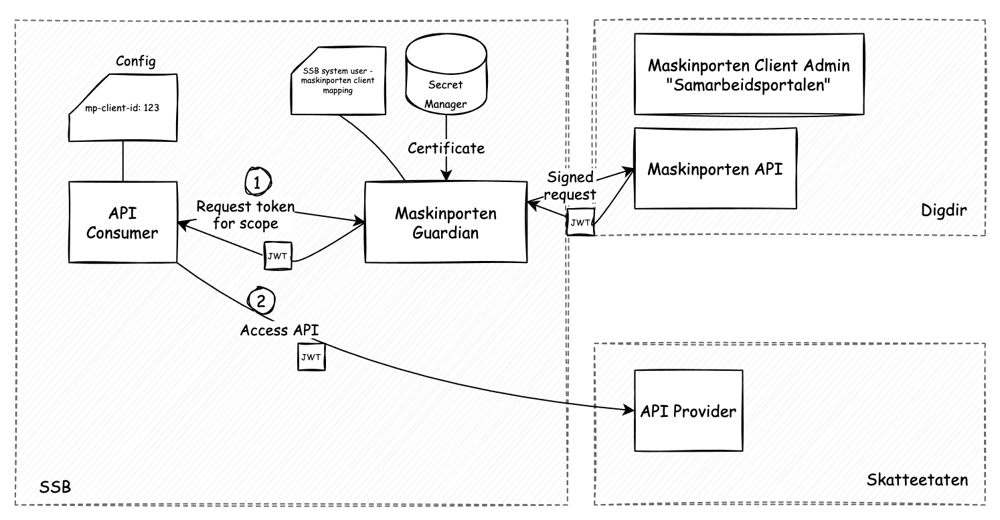

# Maskinporten Guardian


Maskinporten Guardian allows SSB services and trusted users to retrieve
[Maskinporten](https://samarbeid.digdir.no/maskinporten/dette-er-maskinporten/96) access tokens.

> TLDR: Maskinporten Guardian exchanges keycloak access tokens for Maskinporten access tokens.

The Guardian manages sensitive information such as certificates and secrets. It keeps track of who can retrieve access
tokens on behalf of different _Maskinporten clients_. The Guardian also handles audit logging, making it easy to see
_who_ requested access to _what_ API _when_.

## What's Maskinporten?

Maskinporten is a national, common solution providing secure authentication and access control that enables data
exchange between different Norwegian data providers. A [growing number](https://samarbeid.digdir.no/maskinporten/maskinporten/995)
of APIs are being protected by Maskinporten.

Access to Maskinporten is administered via _Samhandlingsportalen_. Organizations (e.g., SSB) that need to consume an
API protected by Maskinporten will create a _maskinporten client_ in this administrative portal. The _maskinporten
clients_ are configured to be trusted with a set of possible "data scopes" for which the client can retrieve data. It
is a prerequisite that an agreement between the data-consuming organization (e.g., SSB) and the data-providing
organizations (e.g., Skatteetaten) must be established in advance.

## How can I get access?

> ~~None shall pass!~~ Only trustworthy ones shall pass!


So, you want to become a trusted party? You will need to:

1. Get hold of a maskinporten client ID associated with the API(s) that you want to consume. Administrators of
   _Samhandlingsportalen_ can help you with this. If in doubt, post a question to Team Argus on the
   #hjelp_dapla slack channel.

2. You will need information about the API you want consume - including the required Maskinporten _data scopes_. This
   is typically something you will need to get from the API provider.

3. The default and preferred way to access Maskinporten Guardian is via so-called _Service Account Users_. These users
   are associated with applications - not persons. Ask Team Argus or Team Stratus to help you create a _Service Account
   User_ associated with your maskinporten client ID. You will get access to a keycloak service account user ID and
   password that can be used to retrieve a service account keycloak token.

   It is possible to access Maskinporten Guardian via your personal user account (using personal keycloak token) as
   well. In this case you will need to ask Team Argus to configure Maskinporten Guardian to trust your user account for
   the maskinporten client ID.

4. With your keycloak token (either a service account or a personal) you will be able to query Maskinporten Guardian for
   a Maskinporten access tokens. Then, use the Maskinporten access token to query the API you want to consume.


## How does Maskinporten Guardian work

A picture says approximately 1000 words:




## Development

Use `make` for common tasks...
```
build-mvn                           Build project and install to you local maven repo
run-local                           Run the app locally (without docker)
release-dryrun                      Simulate a release in order to detect any issues
release                             Release a new version. Update POMs and tag the new version in git
generate-test-virksomhetssertifikat Generate a "virksomhetssertifikat" for test
```

## Usage examples

[Here is an example](https://github.com/statisticsnorway/dapla-dev-cloud-functions/tree/master/guardian-token-retrieval) of a Google Cloud Function that gets a Keycloak token, then accesses Maskinporten Guardian to retrieve a Maskinporten token, used to retrieve a file from an API accessed with a Maskinporten token.

[Here is an example](https://github.com/statisticsnorway/dapla-notebooks/tree/master/demo-2021-10-20) of the same flow un Jupyter.

## References

* https://docs.digdir.no/maskinporten_overordnet.html
* https://github.com/ks-no/fiks-maskinporten


## Micronaut Documentation

- [User Guide](https://docs.micronaut.io/latest/guide/index.html)
- [API Reference](https://docs.micronaut.io/latest/api/index.html)
- [Configuration Reference](https://docs.micronaut.io/latest/guide/configurationreference.html)
- [Micronaut Guides](https://guides.micronaut.io/index.html)
---
